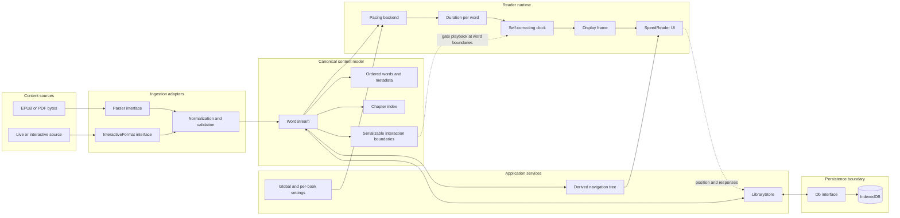

# Speedreader

Speedreader is an offline-first reading system built around one idea: **content should become a stable stream of words before presentation policy is applied to it**.

An EPUB, a PDF, a bundled interactive story, and an open-ended live feed have very different acquisition and resumption rules. Once ingested, however, they can all be navigated, paced, displayed, cached, and resumed through the same format-agnostic contracts.

The application is written in React and TypeScript, runs as a web/PWA application, and can be packaged with Tauri. Its interesting parts are the boundaries between subsystems rather than the platform wrapper.

## Architecture



The arrows describe ownership as much as data flow. Parsers do not choose timing. Pacing models do not parse books. The clock does not understand words. The display does not know whether content came from a file or a network stream.

## The canonical boundary: `WordStream`

`WordStream` is the anti-corruption layer between source formats and the reader. It is deliberately flat and JSON-serializable:

```ts
interface WordStream {
  words: Word[];
  chapterIndex: ChapterEntry[];
  meta: StreamMeta;
  interactions?: ReaderInteraction[];
}

interface Word {
  text: string;
  index: number;
  metadata: Metadata[];
  formatting?: WordFormatting;
}
```

Flattening does not mean throwing structure away. Each word carries an ordered metadata path, while `chapterIndex` provides named ranges for direct navigation. The navigation tree is derived from metadata order rather than being hard-coded to EPUB concepts such as chapter, section, and paragraph. A new format can therefore define a different hierarchy without changing the reader.

This boundary gives the system several useful properties:

- Parsed streams can be cached and reopened without reparsing source files.
- Static and incrementally growing content use the same reader.
- Presentation experiments can run against real content without invoking a parser.
- Storage, navigation, pacing, and display remain format-agnostic.
- Parser changes can invalidate cached streams explicitly through a parser version.

## Separation of concerns

| Concern | Owns | Intentionally does not own |
|---|---|---|
| Ingestion | File recognition, parsing, normalization, source-specific metadata | Timing, rendering, persistence policy |
| Interactive ingestion | Connection lifecycle, chunking, cursors, source resumption state | Reader controls and display layout |
| Library | Import orchestration, hashing, caching, built-in content, streaming writes | Parser internals and playback timing |
| Database | Books, streams, reader state, atomic storage operations | UI state and format decisions |
| Pacing | Mapping a word plus context to milliseconds | Timers, React rendering, file formats |
| Clock | Advancing through a duration sequence while preserving elapsed playback state | Linguistic difficulty and typography |
| Display | Centering the active word and rendering context | Deciding when the next word appears |
| Interactions | Validated descriptors, responses, and boundary gating | Executing source HTML or arbitrary source behavior |
| Settings | Global defaults and per-book overrides | Persistence of book content |

These boundaries are represented by TypeScript interfaces rather than conventions hidden inside components. Most subsystems can be exercised headlessly.

## Design decisions

### Pacing is policy, not timekeeping

A pacing backend implements a small contract:

```ts
type PacingFn = (word: Word, context: PacingContext) => number;
```

It may be fixed, depend on length, or maintain an online probabilistic model. Its output is only a duration in milliseconds. `PacingEngine` applies that policy across a stream; `SelfCorrectingClock` consumes the resulting durations.

Keeping those responsibilities separate matters. A new linguistic model can be compared against existing models without rewriting playback, while clock behavior can be tested with synthetic durations and no knowledge of language.

The current backends are examples of this policy boundary:

| Backend | Modeling idea |
|---|---|
| Fixed WPM | Constant base duration plus structural pauses |
| Length Bayesian | Online Poisson–Gamma estimate of local word length |
| N-gram Normal | Forgotten character-trigram recurrence surprisal calibrated by an online Normal approximation |
| N-gram Exponential–Gamma | The same recurrence signal calibrated by an Exponential likelihood with a Gamma rate prior |

The probabilistic engines are experiments exposed through the production interface, not claims that pacing has been solved. The experiment runner reports full per-word distributions so priors, forgetting, clipping, and total-time drift can be evaluated rather than tuned by intuition alone.

### Playback time is explicit data

The reader calculates a duration array parallel to the word stream. The clock uses `performance.now()` to preserve time already spent on the current word across pause and resume operations, rather than restarting that word's full delay.

Growing streams append durations without restarting the active word. Seeking changes the word index without coupling navigation to the pacing model. Blocking interactions are expressed as boundaries between consumed words, allowing the clock to stop before crossing a boundary and resume without replaying the previous word.

### The focal point is stable; context is not discarded

RSVP interfaces often replace the entire page with a single flashing token. Speedreader instead keeps surrounding text available while pinning the active word to the exact center of the viewport. The display layer measures the rendered active word and translates the context so the eye's focal point remains stable.

This makes presentation a geometry problem isolated from timing: the renderer selects the current frame, React renders context, and layout correction performs the final centering before paint.

### Interactivity is data

Interactive sources emit versioned, serializable descriptors such as text input, single choice, and continue events. Each descriptor belongs to a word-count boundary. The native reader validates and renders those descriptors; it does not execute source HTML or inherit a source runtime's UI.

Responses are also typed data and can be persisted independently of the content stream. This lets interactive fiction, generated material, and ordinary books share navigation and playback while keeping source behavior outside the display layer.

### Local persistence is a replaceable adapter

`LibraryStore` depends on an asynchronous `Db` interface. IndexedDB is the current adapter, not the architecture itself. Books, cached streams, and reader state are separate records with different lifecycles.

Imported files use a SHA-256 content hash as deterministic identity. Opening a book rehydrates its cached `WordStream`; it does not repeat ingestion. Position writes are debounced, flushed when the page becomes hidden, and serialized so an older asynchronous transaction cannot overwrite a newer position.

Global settings live separately from per-book overrides. On open, the reader merges them into an effective configuration without copying global policy into every saved book.

### Static and live sources converge

Batch parsers return a complete `WordStream`. `InteractiveFormat` implementations emit `StreamChunk` values with new words, local interaction boundaries, chapter updates, completion state, and an opaque source-specific state snapshot.

Appending a chunk is a normalization step: indices become global, local boundaries are offset, duplicate interaction IDs are rejected, navigation ranges are updated, and stream statistics are recomputed. Downstream components see a growing `WordStream`, not a special live-reader mode.

## Extending the system

### Add a content format

Implement `Parser` for deterministic file ingestion or `InteractiveFormat` for a stateful source. Emit normalized words and structural metadata; do not add source-specific logic to the reader.

### Add a pacing model

Implement `PacingFn`, wrap it as a named `PacingBackend`, and register it in the pacing registry. The existing experiment harness can compare its duration distribution before it is made selectable in Settings.

### Add a storage backend

Implement `Db`. Library and reader coordination should not require changes.

### Add an interaction kind

Extend the versioned descriptor and response unions, validate the new shape, and add a native renderer. Source formats should continue to emit data rather than UI code.

## Repository map

```text
experiments/                 Design notes and architectural investigations
frontend/
  experiments/              Headless integration and pacing experiments
  src/
    db/                      Storage contracts and IndexedDB adapter
    display/                 Clock, frame construction, focal layout
    ingestion/               Parsers, live formats, stream normalization
    interactions/            Serializable actions, validation, native UI
    library/                 Import/cache/resume orchestration
    navigation/              Metadata-derived navigation
    pacing/                  Timing policies and probabilistic models
    reader/                  Reader composition
    settings/                Global and per-book configuration
  src-tauri/                 Native packaging shell
```

`ReaderApp` is the composition root. It creates concrete adapters, coordinates the open reader session, and connects persistence to React state. Domain logic lives below it rather than accumulating in the root component.

## Development

Requirements:

- Node.js 20 or newer
- npm 9 or newer
- Rust and the platform-specific Tauri prerequisites only when building the native shell

```bash
cd frontend
npm install
npm run dev
```

The development server runs at `http://localhost:1420`.

The normal verification path is:

```bash
cd frontend
npm run check
```

This runs linting, TypeScript validation, the Node test suite, and a production Vite/PWA build.

Useful focused commands:

```bash
npm test
npm run test:watch
npm run typecheck
npm run experiment:surprisal
npm run tauri dev
```

The web production bundle is written to `frontend/dist/`.

## Experiments and design history

The repository keeps design work close to the implementation:

- [`experiments/`](./experiments/) contains questions, notation, and findings that are not yet settled product behavior.
- [`frontend/experiments/`](./frontend/experiments/) contains executable probes over real and synthetic streams.
- [`plan.md`](./plan.md) records the broader implementation plan and open architectural questions.
- [`ChangeLog.md`](./ChangeLog.md) records behavior that has landed.

That distinction is intentional: an experiment may use the production contracts without being presented as a finished or validated model.
