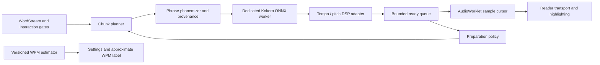

# Offline Kokoro read-aloud implementation specification

Status: experimental PWA implementation is available behind `?kokoro=1` (and in
Vite development). One English voice, local ONNX duration synthesis, two speed
controls, AudioWorklet playback and offline pack management are implemented.
Chromium/Firefox WASM, root/subpath offline controls, voice preview and real
cross-tab update checks have passed. Release promotion
still requires the device/listening gates below; do not treat synthetic timing
checks as audible alignment certification.

## Implementation progress

- Python synthesis, source-word annotations, ten full-speech measurements and the
  bounded rational-quadratic fit are preserved in the Kokoro experiment.
- Implemented validated global/per-book audio preferences and an explicitly
  experimental Python-baseline WPM display, separate from observed speech WPM.
- Exposed native durations in the pinned Compact graph without changing its
  inference operations. Original/export waveforms were bit-identical at four
  pacing values. The browser protobuf patch decodes to the same model.
- Implemented a dedicated ONNX worker, one session per reader, installed-only
  runtime resolution, WebGPU initialization with WASM fallback, and explicit CPU
  retry. Chromium WASM native durations differ by at most one frame from CPU ONNX
  on the fixed fixture; each browser result supplies its own alignment.
- Implemented English phrase phonemization with original source spans, explicit
  title/currency expansions, token ownership, token-limit splitting and visible
  failures for unsupported symbols/scripts. The browser dictionary/rules are
  HeadTTS-derived, not a claim of identical Misaki contextual pronunciation.
- Implemented SoundTouch WSOLA in a separate worker, with recorded source/output
  window landmarks and input-window-sized flushing. A single 24 kHz Web Audio
  context leaves device-rate conversion to the browser.
  Pitch remains fixed at zero; tempo is pitch-preserving.
- Implemented a sample-driven AudioWorklet sink, separate user play intent,
  bounded configurable preparation, native/processed caches, stale-result checks,
  pause/seek, stalled-device detection, all presentations, ordered triggers, interaction cutoffs, content
  invalidation, live-tail waiting and background pause.
- Added install/verify/repair/remove/discard, cancellation, hash/size verification,
  local synthesis before installation commit, shared-file ownership and retired
  upgrade assets. Pack bytes use a separate Cache Storage namespace; metadata uses
  IndexedDB. Cross-tab mutations use Web Locks.
- Added numeric/slider/step controls, voice preview without moving the book,
  backend/timing diagnostics and inactive visual-pacing controls during audio.
- Replaced immediate PWA reloads with reader leases across tabs. Optional WASM is
  installed with the voice, rather than added to mandatory application precaching.
- Automated coverage includes source mapping, model/DSP geometry, pitch retention,
  queue limits, stale work, pause/buffering, empty-queue handoffs, settings changes,
  offline reopening and pack failure paths. The full-speech sustained browser run
  passed 1,800 seconds, reached the end of the 4,023-word speech and restarted.
  Its final-window observed speech was about 625 WPM at 1.5x pacing/2.4x compression,
  excluding buffering. Peak sampled main-thread heap was 72.3 MB; full process
  memory and audible alignment are not certified. Reports record the headless
  autoplay override and other test setup in the experiment directory.

### Trying the prototype

Build/serve the PWA, open it with `?kokoro=1` (for Pages:
`/speedreader/?kokoro=1`), open a saved English passage and expand **Read aloud**.
You can also install, repair or remove the Heart voice from the library’s
**Global settings → Offline voices** section before opening a book. Downloads are
shared across books; closing global settings cancels unfinished installation and
keeps verified files for retry.

Install the Heart voice, enable Read aloud, then press Play. Installation itself
never starts audio. Close the controls to leave more room for reading. Keep the
query parameter when reopening this development-gated prototype.

The optional pack is approximately 117.5 MB. Generated speech stays in bounded
memory caches, not persistent storage. The default ready queue holds at most two
chunks; its policy can be replaced without changing synthesis or playback.
Native PCM cache: 11.52 MB/12 entries. Processed PCM cache: 8.64 MB/8 entries.
Ready queue: 8.64 MB/two chunks. These budgets are separate; referenced buffers can
overlap. Model/session, DSP scratch, resampling and the active worklet allocation
are additional and need device memory measurements. The worklet refuses more than
120 seconds of PCM. The planner normally limits a chunk to 24 original words and
prefers sentence boundaries.

### Remaining release gates

- Real WebGPU hardware parity/throughput and loss recovery; this host has no GPU
  hardware adapter. SwiftShader software WebGPU executes the graph, but differs
  from CPU durations by up to 25 frames and does not establish hardware parity or
  throughput. Chromium WASM is not a proxy for phone or GPU performance.
- Manual listening and original-word onset checks, especially suffixes at high
  pacing, chunk seams, resampling and device output latency. Model frames are not
  themselves evidence of audible onsets. Synthetic DSP landmarks are checked
  against an 80 ms burst-onset neighborhood; this is not a speech acceptance bound.
- Desktop Edge, Android Chrome, iPhone Safari/PWA and Firefox validation, including
  interruption/background behavior and complete worker/WASM/native memory.
- Independent pitch shifting remains the explicitly deferred follow-up in this
  plan; there is no pitch slider in the two-control prototype.
- Promote the development gate only after the above evidence is collected. The
  exposed 0.5–4 ranges remain experimental, not published supported listening ranges.

### Stage status

| Stage | Status |
| --- | --- |
| Contracts and estimator | Implemented; unit and persistence checks pass |
| Browser feasibility | WASM and software WebGPU execute; physical GPU and audible parity remain gates |
| Short-passage PWA | Implemented; offline Chromium/Firefox controls and preview verified |
| Continuous reading | Bounded producer/sink contracts, queue policies, caches, source changes and sustained WASM test |
| PWA hardening/release | Pack lifecycle and cross-tab updates implemented/tested; device/listening release matrix remains open |

The automated reports disclose fixture downloads, virtual audio devices and any
autoplay override. They establish local synthesis and transport behavior, not
human listening quality or complete process-memory bounds.

## Product contract

Read aloud is an optional mode. When enabled, audio owns reader progression.
Kokoro is the only TTS model. Text, synthesis, alignment, and audio processing
remain local after installation. No cloud or system-speech fallback is permitted.

Users choose voice, Kokoro phoneme pacing, and independent pitch-preserving time
compression. Independent pitch remains in the full feature scope, but stays at
zero semitones in the first PWA prototype. There is no target-WPM control or
feedback loop. In audio-enabled read-along view, show a read-only approximate WPM
from the versioned fitted equation. An optional, separately labeled observed WPM
uses consumed original words and actual speech playback time, excluding buffering
and explicit pauses. Neither value drives progression.

The existing visual pacing settings remain saved. In audio mode their controls
are inactive and explain "Timing follows speech." Disable audio to restore them.

Initial scope: English, RSVP, context and read-along views, saved text, and
already available text from live sources. New live-source content still needs a
connection. Preserve pause-on-background; background narration, audiobook export,
voice cloning and additional TTS models are outside this release.

## Current integration points

Integration points rechecked against HEAD `44dc4bc` and the current experiment
files on 2026-09-15. The paths below describe the existing implementation.

- frontend/src/display/clock.ts: silent SelfCorrectingClock and interaction gates.
- frontend/src/display/types.ts: separate common transport and silent duration-array contracts.
- frontend/src/display/SpeedReader.tsx: clock ownership, navigation, triggers,
  live stream extension, rendering and pause-on-background.
- frontend/src/reader/ReaderScreen.tsx: effective settings and pacing creation.
- frontend/src/settings/types.ts: defaults and per-book overrides.
- frontend/src/ReaderApp.tsx: position persistence and source coordination.
- frontend/vite.config.ts: PWA precaching, optional WASM exclusion and deferred activation.
- frontend/src/main.tsx: reader-safe update/controller-change coordination through pwa-update.ts.
- frontend/src/display/playback-boundary.ts and crossed-triggers.ts: existing shared
  boundary/trigger helpers to retain for both controllers.
- frontend/src/audio/alignment.ts: native duration projection primitives; phonemizer.ts supplies source ownership.

Extract shared transport operations from duration-specific operations. Keep the
silent controller's behavior intact; add an audio controller rather than feeding
speech durations to a second independent timer. Both controllers use shared
interaction and engine-trigger delivery logic.

## Controls and defaults

| Control | Default | Behavior |
| --- | --- | --- |
| Read aloud | Off | Persist through existing global/per-book settings inheritance |
| Voice | af_heart | Choose from installed English Kokoro voice embeddings |
| Kokoro pacing | 1x | Model phoneme-duration control; experimental 0.5–4x, released range follows listening tests |
| Time compression | 1x | Independent pitch-preserving DSP; experimental 0.5–4x |
| Approx. WPM | Read-only | Rational fit of pacing × compression; visible in audio-enabled read-along |
| Pitch | 0 semitones | Separate future control; first PWA slice fixes pitch at zero |
| Preview | User action | Short local sample with current settings |
| Downloads | None | Install, inspect, repair and remove packs |
| Observed WPM | Read-only | Never feeds back into synthesis |

Use two sliders with accessible numeric inputs and step buttons for pacing and
compression. Start at 1x/1x; keep high model pacing experimental because word
endings sounded degraded in the 4x Python sample. Encourage comparison by
increasing compression while leaving model pacing moderate.

Persist flat settings through the existing global/per-book merge:
`readAloudEnabled=false`, `readAloudVoice="af_heart"`,
`kokoroPacing=1`, `speechCompression=1`. Add `speechPitchSemitones=0` when pitch
is implemented. Keep the visual `wpm` setting independent. Validate finite values
and supported ranges when loading old settings; store neither derived estimates
nor transient buffering/play intent. Pack installation state belongs in its own
IndexedDB metadata, not these preferences.

Use accessible numeric inputs and step buttons. Do not announce every word to
screen readers. Announce loading/error states without continuous live-region
noise. Opening a book never autoplays audio.

First activation offers a download with actual total bytes. The states are
not-installed, downloading, verifying, installed and repair-needed. Installation
completion does not itself start playback; the user presses Play.

## Evidence and decisions from the experiment

Evidence: [experiment README](../frontend/experiments/kokoro/README.md) and
[recorded measurements/fits](../frontend/experiments/kokoro/surface-results.json).

- Ten sampled pairs used the complete 4,023-word Arsenal of Democracy passage,
  one English voice (`af_heart`), and the pinned Python Kokoro v1.0 model.
- Native pacing was nonlinear and approached a plateau: approximately 126 WPM at
  0.712x, 188 at 1.088x, 289 at 1.644x, and 393 at 3.685x. Near the high end,
  approximately 97% of model tokens reached the one-frame duration minimum.
- Post-synthesis tempo processing changed WPM almost multiplicatively: maximum
  measured deviation was approximately 0.020%. This validates the Python FFmpeg
  experiment's duration behavior, not browser DSP alignment or intelligibility.
- The bounded rational quadratic has 8.56 WPM leave-one-out error before
  compression (16.11 WPM after applying the sampled compression factors). The
  ordinary quadratic has 8.23 WPM error but develops an artificial downturn.
- CPU generation times came from an experimental environment with concurrency,
  cache/memory pressure and interrupted/resumed runs. Do not use those wall times
  to predict WebGPU throughput. Persistent checkpoints and memory budgets remain
  useful design lessons, not a reason to persist generated browser audio.

### Approximate WPM contract

For Kokoro pacing `p` and post-synthesis compression `c`, initially use:

```text
approxWpm(p, c) = c × M × p² / (K² + p²)
M = 437.94687151680654
K² = 1.3766378138970434
```

This bounded rational-quadratic form is the selected initial estimator. `M` is a
fitted asymptote for native synthesis, not a hardware throughput limit or a proven
physical maximum. Compression multiplies the estimate; independent pitch should
not affect duration once its DSP path is validated.

Implement it as a pure `estimateWpm(settings, profile)` function. Return the
numeric estimate plus profile ID, compatibility and extrapolation status. Keep
coefficients in versioned data keyed to model/export, voice/language, text counting
convention and DSP calibration; never embed them in the transport or settings UI.
The initial profile is experimental English/`af_heart`, 4,023 whitespace-delimited
source tokens including standalone punctuation, and Python model/DSP provenance.
Browser parity promotes a corresponding browser profile; another voice or model
revision must not silently inherit a claim of validated accuracy.

- In audio-enabled read-along, show `≈ N WPM`, rounded to the nearest five, near
  the two controls. Silent read-along continues showing its visual pacing WPM.
- Update the estimate instantly as pending settings change. If playback still
  uses the old chunk, label the setting change as applying at the next phrase;
  never present the pending estimate as an observed current rate.
- The measured ranges are `p=0.712–3.685` and `c=0.773–3.871`. Experimental controls
  may still cover 0.5–4x, but show `Experimental estimate` outside those ranges.
  Do not clamp the estimate at the data boundary. For an incompatible profile,
  show that no calibrated estimate is available, or explicitly label a baseline
  estimate as provisional in development.
- The label is visible while paused/preparing, with a separate Preparing/Buffering
  status. It describes speech pace, not elapsed wall-clock reading throughput.
  Do not announce every estimate/word continuously to assistive technology.
- Keep optional observed WPM separate. Count original source words over consumed
  speech samples, including model pauses but excluding explicit pause and underrun
  silence. Reset its window on seek, content revision or speed application; do not
  count context synthesized for a seek unless actually played.
- Never derive word timestamps, queue durations or a target-WPM feedback loop from
  this estimate. Replace coefficients when browser/passage/voice evidence warrants;
  synthesized sample lengths and validated alignment remain authoritative.

## Modular browser architecture

Keep this as a small pipeline under `frontend/src/audio/`, extending the existing
`alignment.ts`. Modules are boundaries between responsibilities, not separate
services or additional AI models.



| Module / proposed file | Owns | Must not own |
| --- | --- | --- |
| `estimate.ts`, `profiles.ts` | Rational equation, provenance and compatibility | Word timing, buffering or playback decisions |
| `chunk-planner.ts` | Stable source ranges, phrase boundaries, token-limit checks, unresolved-action cutoffs | Executing ingestion actions or inferring waveform lengths from the WPM fit |
| `phonemizer.ts` | Phrase-level normalization and word-to-phoneme provenance | Guessing source identity from character-length timing |
| `protocol.ts`, `synthesis.worker.ts`, `kokoro-backend.ts` | Local ONNX session, runtime probe, waveform + durations, staged timings | DOM, audio playback or deciding when to resume |
| `dsp.ts` | Native-to-output PCM conversion, tempo/pitch processing, latency/padding and sample mapping | Retokenizing source text or inferring word times from total compression alone |
| `preparation-policy.ts`, `queue.ts` | When/how much to request, byte/count budgets, ready ordering and backpressure | Advancing the current word or overriding user pause |
| `audio-transport.ts`, `pcm-worklet.ts` | User intent, sample consumption, buffering/end state, seek and disposal | Synthesizing text on the audio rendering thread |
| `pack-store.ts`, `asset-resolver.ts` | Verified local files, compatibility, install/repair/removal | Hidden network fallback during installed playback |
| `metrics.ts` | Timings, buffer occupancy, underruns, backend/pack identity | Persisting passage text in diagnostic logs by default |

### Minimal contracts for the first slice

Specify these contracts before wiring model or React code:

- **Request identity:** session ID, request ID, chunk ID, content revision,
  synthesis revision and DSP revision. Include stable source start/end word
  indices and the exclusive allowed interaction boundary. Cancellation is best
  effort; every downstream consumer must reject stale responses independently.
- **Prepared text:** normalized spans, phoneme IDs and explicit original-word
  ownership, including expansions/unspoken tokens and boundary-token offsets.
  The synthesis adapter accepts this checked input and enforces the actual export
  token limit; it never silently truncates.
- **Synthesis result:** identity, mono PCM, sample rate, phoneme durations, validated
  native word/sample ranges, graph/runtime identity and timing metrics. Transfer
  ArrayBuffers between worker/main/worklet rather than cloning large PCM arrays.
- **Processed result:** identity, output PCM/sample rate, output word/sample ranges
  and source-to-output sample map, with documented DSP latency and padding. A
  browser processor may subdivide a chunk into PCM blocks; the transport should
  not depend on a single large output allocation. The first backend may return
  one complete chunk; an async producer adapter can yield ordered blocks later.
- **Transport:** common start/play, pause, seek, snapshot/subscribe and dispose
  operations; state includes user play intent, current word, consumed samples,
  buffered playable seconds and explicit playback state. Silent duration updates
  remain on the silent adapter, not on the shared transport interface.

React integration must distinguish `playIntent`, `isAdvancing` and an explicit
user Pause event. `ReaderScreen.handleRunning` currently calls `onPause` whenever
running becomes false; a transient audio-buffer underrun must not accidentally
trigger that callback and stop a live source needed to refill the queue. Adapt
reader callbacks to the transport snapshot and preserve explicit pause/background
semantics in `ReaderApp`.

Cache native synthesis separately from processed audio. The native cache key
includes pack/export, voice, pacing, phoneme/source content and revisions; the
processed key adds compression, pitch, output rate and DSP version. Changing
compression can reuse bounded native PCM. Changing voice/pacing invalidates future
native results; changing views invalidates neither. Active audio retains its
settings until the chosen chunk boundary; drop/rebuild future work on a revision
change and recheck interaction gates immediately before enqueueing.

### Preparation policies, without an early buffering commitment

The transport supports `preparing` and `buffering` from day one even if a fast
backend rarely enters them. Separate source starvation (waiting for new live text),
synthesis delay and a suspended AudioContext in status/retry handling.

1. **Single prepared chunk policy:** the first browser probe prepares a short
   complete chunk before starting. It may prepare one successor while playing.
   This proves transport/alignment without a sophisticated adaptive scheduler.
2. **Bounded lookahead policy:** the same interfaces admit a configurable queue
   with minimum/target output seconds plus maximum chunks and bytes. Measure 2,
   5 and 10 seconds as candidates, rather than hard-coding ten seconds. Queue
   accounting uses actual post-DSP samples at the playback sample rate.

Keep one active synthesis request/session; queue future requests with backpressure.
Account for native PCM, DSP scratch/output, in-flight work and worklet buffers in
memory reporting. Set explicit conservative prototype budgets (for example three
ready chunks and 16 MiB of retained PCM, independent of model/session memory),
measure peak allocation, and revise on mobile evidence. Split or reject a chunk
that cannot fit; do not exceed the limit just to meet a time target. Keep any rewind
cache inside the same total PCM budget. Do not add persistent generated-audio cache
or whole-book pre-generation to the first prototype.

If the ready queue drains, retain the word/sample cursor and play intent, output
silence without advancing the speech cursor, and resume only if intent remains
Play and no blocking interaction appeared. Fake producers must be able to exercise
fast, slow, variable and non-cancellable inference without changing UI code.

## Browser performance experiment and decision points

WebGPU having a higher initialization cost but faster steady-state inference is a
reasonable hypothesis; it is not established by the Python tests. Our benchmark
will distinguish session creation, first inference and subsequent runs, using the
profiling and provider diagnostics described in
[ONNX Runtime guidance](https://onnxruntime.ai/docs/tutorials/web/performance-diagnosis.html).
Measure each separately on the exact graph and device before selecting a default.

Record download/verification time separately from cached local asset reads, session
creation, first inference, warm inference, phonemization, CPU/GPU transfers, DSP,
queue wait and time to audible output. Reuse one session during a reader session;
do not rebuild it on every chunk, view change or compression adjustment. Start
initialization after explicit activation/preview, show its state, and avoid
blocking the user gesture needed to unlock Web Audio.

Define sustained readiness using output that the user actually consumes:

```text
playableSeconds = processedSampleCount / playbackSampleRate
productionRatio = endToEndChunkProductionSeconds / playableSeconds
```

A ratio below 1 is necessary to keep up on average; tail latency needs additional
headroom. A 4x compression setting leaves roughly one quarter the synthesis audio
playback time for producing the next chunk. Compare median and p95, startup stalls,
underruns and peak memory for short/medium/near-limit chunks. Do not use the fitted
WPM equation as a production-rate estimator. If sustained production is slower
than playback, buffering only postpones stalls; show buffering or offer an explicit
settings change, never silently reduce speed.

Probe WebGPU and WASM independently using already-installed compatible assets.
Record actual provider selection/fallback; run a real synthesis smoke test rather
than treating API availability as success. WebGPU is a first-class experimental
path. Start with ordinary execution; investigate graph capture only if the dynamic
shapes/control flow of the chosen duration-enabled export support it. See
[ONNX Runtime WebGPU](https://onnxruntime.ai/docs/tutorials/web/ep-webgpu.html).
Use a dedicated worker directly, with no ORT WASM proxy flag for WebGPU. The
non-isolated WASM case must work with one thread; multiple WASM threads require
cross-origin isolation ([runtime flags](https://onnxruntime.ai/docs/tutorials/web/env-flags-and-session-options.html)).

The prototype selects pinned SoundTouch JS 2.1.1 WSOLA with recorded window
landmarks. Python FFmpeg/Streamlit remains an experiment, not a shipped PWA
dependency. Automated fixtures check pitch retention, duration, padding and
monotonic mapping. Listening, seams and speech word-onset validation still gate
production promotion: a near-perfect total-duration ratio does not prove per-word
alignment.

## Model and runtime

Pin Kokoro 82M v1.0, tokenizer, phonemizer, voice embeddings, ONNX Runtime and DSP
assets to immutable versions. Record attribution and each dependency's license.

Candidate packs:
- Compact: q8/WASM; upstream weights approximately 92.4 MB.
- Accelerated: fp32/WebGPU; upstream weights approximately 326 MB.

These are weight sizes, not final pack size or peak memory. Duration-enabled
exports may differ. Keep Compact as the compatibility candidate; benchmark
Accelerated/WebGPU early before deciding which pack to recommend on capable
devices. Availability of `navigator.gpu` alone is not a successful model probe.
Offer Accelerated only with capability validation and explicit download size.
Never download both automatically.

An accelerated pack can fall back only to a validated runtime using installed
assets. Test fp32/WASM before advertising it as a fallback. Offline failure must
not initiate an undisclosed download of another precision.

Use a dedicated synthesis worker and one active inference session. WASM must
work without cross-origin isolation; enable multiple threads only when supported.
Do not use ONNX Runtime's WASM proxy-worker flag for WebGPU. Lazy-load synthesis
and preserve the small initial app download.

## Alignment feasibility gate

Kokoro computes predicted phoneme-token durations. Its Python ONNX wrapper
returns waveform and duration, but the current JavaScript wrapper extracts only
waveform. Inspect the selected graph outputs first. If necessary, create a
reproducible export with duration output and verify numerical/audio parity.

Preserve a reversible mapping:
original word indices -> normalized spoken spans -> phoneme tokens -> samples.

Requirements:
- Keep phrase context during normalization and phonemization.
- Track expansions such as $25 and abbreviations back to the original token.
- Handle contractions, punctuation, hyphens, Unicode and unspoken symbols.
- Account for boundary tokens, silence and decoder offsets.
- Derive frame-to-sample conversion from the exact model/export.
- Validate monotonic boundaries and audio bounds.
- Validate audible alignment at multiple speeds, not just matching total length.

Model-derived durations are not automatically exact word timestamps. Do not use
uniform per-word or character-length estimates as the shipped RSVP alignment.
No separate forced-alignment model is included. If this gate fails, the feature
remains draft and unavailable, with the failure recorded.

## Text chunking

Build clauses/short sentences from the existing wordstream, preserving source
indices, punctuation, paragraphs, interaction boundaries and content revision.
Respect the actual phoneme-token limit before inference; never silently truncate.

For growing sources, commit complete clauses, then flush the final fragment on
source completion. Do not repeatedly regenerate a clause as tokens arrive.
Chunk building must not execute ingestion actions or cross unresolved choices.

Generate one short chunk to start. Use the replaceable preparation policy below;
a ten-second lookahead is an experiment to measure, not a fixed product contract.
All policies are bounded by both queue length and a memory ceiling. Tune on mobile.
Keep a bounded in-memory cache for rewind. Persistent generated audio is not
needed for offline use; the installed model regenerates saved text.

## Audio transport and processing

The audio controller owns:
- play/pause/seek and user play intent;
- synthesis queue and revisions;
- sample cursor and word mapping;
- buffering, interaction, end and error states;
- resource disposal.

Use Web Audio and an AudioWorklet for PCM scheduling. Select a maintained,
license-compatible DSP implementation through a small benchmark for independent
pitch and speed. Do not implement pitch by playback-rate changes alone.

Expose Kokoro pacing and pitch-preserving compression independently. Use the
rational fit for display only, with versioned coefficients that can be replaced
without changing transport. There is no target-WPM calibration loop.
Duration-preserving pitch processing must account for latency and padding. Test chunk seams and sample-rate conversion (model output is 24 kHz).

The progress cursor counts speech samples consumed, not silent underrun samples.
Track source-to-output sample mapping after DSP and compensate for output latency
where measurable. UI animation reads this cursor; UI timers never own progression.

If a rendered frame crosses several word boundaries, deliver all intervening
nonblocking triggers in order. Enforce blocking boundaries before queuing audio,
so main-thread delays cannot speak beyond a pending interaction.

Separate user play intent from actual playback:
paused, preparing, playing, buffering, waiting-for-interaction, ended, error.
Resuming after buffer recovery must not override a user's intervening Pause.

## Reader transitions

| Event | Required behavior |
| --- | --- |
| Enable during silent playback | Stop silent clock at current word; prepare and continue audio |
| Disable during audio playback | Stop audio; restore silent pacing at current word |
| Pause/resume | Keep current chunk sample offset |
| Seek/sentence navigation | Cancel old queue; move and remain paused |
| Presentation switch | Keep transport and sample position |
| Voice/Kokoro pacing change | Apply at next chunk boundary; regenerate future synthesis |
| Compression change | Apply at next chunk boundary initially; reuse native PCM, rebuild future DSP output/timing |
| Pitch change | Smooth transition with unchanged logical word timeline |
| Content edit | Invalidate affected chunks and alignments |
| Interaction | Pause at boundary; obey existing resolution/resume semantics |
| Leave reader/change book | Stop, cancel, save and release resources |
| Background/lock screen | Pause and save |
| Reopen | Restore word/settings; wait for Play |

All worker requests carry a session ID, content revision and settings revision.
Discard stale responses even when an inference cannot be interrupted.
Recheck interaction state before scheduling completed work.

On resume after reload, restart the saved word. When seeking inside a sentence,
synthesize sufficient preceding context if needed, then start at its validated
word boundary. Do not replay preceding context audibly without user action.

## Offline storage and updates

Use Cache Storage for immutable downloadable assets and IndexedDB for manifests
and installation metadata. Shared weights are stored once; voice removal must not
remove files referenced by another installed voice.

A manifest contains pack ID/version, runtime compatibility, asset URLs, hashes,
sizes and roles. Validate every required asset and run local synthesis before
committing installed status. Retry incomplete downloads; reuse verified files.

Cache all model, tokenizer, phonemizer, runtime JS/WASM, worker and DSP assets.
Pin local resolution; installed playback must not require CDN/version requests.
Do not rely on incidental HTTP cache or a successful online inference.

Request persistent storage, handle quota errors and check asset presence on use.
An installed flag alone is not proof that files survived browser eviction.

PWA work:
- Current precache glob omits wasm; explicitly handle required WASM.
- Keep optional heavy assets separate from mandatory app precache.
- Preserve voice packs during ordinary service-worker cache cleanup.
- Preserve compatible runtime assets across app updates.
- Stage replacement packs and commit only after validation.
- Never delete the usable old version before a replacement is complete.
- Test both root paths and the /speedreader/ Pages base.
- Replace aggressive `autoUpdate`/`skipWaiting` and unconditional controller-change
  reload with a coordinated update flow. Defer activation/reload during preparing,
  playing, buffering or an active interaction. Apply at a safe paused/reader-exit
  boundary after flushing position and disposing the old session. Coordinate
  across open tabs; preserve runtime assets used by an older controlled client.
- Pin worker, graph, runtime and DSP revisions for an audio session. Do not mix
  revisions when an update is waiting or installed.
- Do not use the service worker as a long-lived synthesis worker.

## Failure behavior

Download failure: retain verified files and offer retry.
Quota failure: show required space and removal options.
Evicted/corrupt pack: offer Repair; keep silent reader usable.
GPU failure: use validated installed WASM path or pause with explanation.
Slow inference: buffer at the current word; do not silently reduce speed.
Suspended audio context: explicit Resume audio.
Synthesis/alignment failure: pause affected passage; Retry or Disable audio.
Unsupported language: explain initial English support.
No failure may silently skip text or send it to a remote service.

## Revised implementation stages

Each stage is a reviewable increment. Browser probe work and pure controller tests
can proceed independently; production activation remains gated by real alignment.

1. **Contracts and estimate (no model download).** Add audio setting defaults and
   validation, versioned `estimateWpm`, common transport types, worker messages and
   a deterministic fake producer. Adapt the silent clock without behavior changes.
   Deliver tests for settings inheritance, estimate bounds/labels, cancellation and
   pause intent. Keep read-aloud behind a development gate until a real path works.
2. **Browser feasibility probe.** Produce a pinned duration-enabled ONNX export;
   compare waveform/duration behavior with Python. Implement phrase phonemization
   and original-word provenance in the browser. Test WASM and WebGPU using the same
   fixtures where precision permits. Report actual providers, cold/warm timing,
   memory and sample geometry. No truncation and no retranscription. This is the
   next runtime experiment, before choosing a permanent queue policy.
3. **Short-passage PWA slice.** Package one verified voice (`af_heart`), local asset
   resolver and minimum install/verify/repair flow. Generate one prepared chunk,
   apply browser pitch-preserving DSP and play through the AudioWorklet. Add the
   two controls and approximate WPM to read-along. Prove pause, seek, disposal,
   sample-based highlighting, compression alignment and offline reopening. Initial
   DSP identity mode at compression=1 is useful for isolation; it is not acceptance
   of the two-control slice. Independent pitch remains deferred.
4. **Continuous reading and runtime selection.** Enable bounded lookahead through
   `PreparationPolicy`, then tune from actual browser measurements. Extend to long
   books, append-only streams, content edits and unresolved interactions; verify
   all three presentations retain a single transport. Add backend loss/recovery,
   session reuse, cache budgets and the sustained compressed-throughput matrix.
   Do not mask insufficient throughput with a bigger unbounded queue.
5. **PWA hardening and release.** Complete pack removal/shared-file ownership,
   staged upgrades, storage eviction/quota paths, update coordination across tabs,
   root/Pages-base offline tests and the long-session device matrix. Validate
   independent pitch before exposing its control. Publish measured supported speed
   ranges and onset tolerance. Promote from development gate only after release
   checks pass.

### First browser prototype definition of done

A saved English passage can be opened in the production PWA, with network access
blocked after explicit pack installation. Pressing Play initializes the worker,
then plays locally while highlighting original words from consumed samples. The
two speed controls are independent, the approximate WPM label responds without
synthesis, and Pause during preparation prevents later autoplay. Seeking cancels
old work and remains paused. Changing views retains the transport. Leaving the
reader or hiding the page releases/pauses resources and saves the current word.
A status/measurement report distinguishes installation, initialization, first
inference and playback; no claim of sustained full-book performance is required
until stage 4.

## Verification and release gates

### Experimental Piper adapter

The **Speech model** dropdown selects Kokoro Heart or Piper Lessac Low. Each has
its own optional install/repair/remove pack, available in the reader and Global
Settings → Offline voices. Shared dictionary/runtime files are reused and retained
when the other installed pack still needs them. Changing models pauses playback
and requires enabling Read aloud again. Model choice is saved with reader settings;
the download menu chooses which pack to manage, not a global playback preference.

Piper uses ONNX Runtime Web 1.30.0 with the existing WASM/WebGPU backend selector.
The pinned Lessac Low graph exposes `/Ceil_output_0`; 256 samples per frame at
16 kHz are checked against the PCM length. Native pacing applies
`length_scale / pacing`; SoundTouch compression and sample-based highlighting
use the existing transport. No Kokoro WPM estimate is displayed for Piper; observed
speech WPM remains available. Model bytes are integrity-checked before patching,
and the patched graph and config have independent pinned digests.

The browser adapter reuses HeadTTS English normalization and original-word
provenance, expanding its compact phoneme notation to Piper's IPA vocabulary.
It does **not** use the Python experiment's eSpeak frontend. Pronunciation/prosody
and exact audible onsets therefore require listening validation; unmapped phonemes
fail explicitly. No ASR or waveform retranscription is introduced. Python Piper
code is not shipped to the browser. The voice's model card links its own dataset
terms, exposed beside installation controls.

Browser smoke coverage includes both providers (software WebGPU only), native
and compressed PCM word bounds, a real installation synthesis probe, and switching
between models without losing the Piper installation. See
`frontend/experiments/tts-alternatives/browser_piper.py`; this is not a hardware
GPU performance or audio-quality certification.

Sentence-pause investigation: the transport bypasses visual pacing pauses, but
independently generated chunks retain leading/trailing quiet audio. One saved
1.30.0 test phrase at 1×/1× measured about 282 ms leading and 434–449 ms trailing
quiet at a 0.001 peak-amplitude threshold; this is a diagnostic observation,
not an exact speech-onset detector or a measurement of the user's session.
Chunk selection now prefers the last sentence boundary within the existing
24-word budget, grouping short sentences while preserving punctuation and
source ownership. No PCM or word suffixes are trimmed.

The sticky Read aloud summary keeps backend, status, and observed WPM on
separate lines. **Last chunk wait** measures time from the previous chunk's
completion notification to enqueueing the next chunk. It excludes quiet audio
inside the waveform and user pauses, and is not an audio-device latency measure.
Long waits identify preparation/handoff delays; low waits with audible pauses
point toward generated audio. Synthesis throughput can still limit playback.

The app now pins ONNX Runtime Web 1.30.0 and its matching Asyncify WASM
binary, used by the native WebGPU bundle. After upgrading from 1.22.0, use
**Repair voice** to install the new runtime and update pack compatibility
metadata. Verified model, voice, and dictionary assets are reused. Historical
1.22.0 benchmark reports do not establish performance or quality for 1.30.0.

The browser reader currently defaults to CPU/WASM. Do not automatically select
WebGPU for the Compact quantized graph: its execution/geometry probe did not
establish waveform or listening parity, and distorted playback was reported at
1× pacing and 1× compression. WebGPU remains explicitly selectable by diagnostic
code pending validation. Installed voices expose **Retry with CPU** even without
a runtime exception; incorrect audio can occur without an inference error.

Automated tests:
- Original-word mapping for numbers, punctuation, contractions and Unicode.
- Token-limit splitting without lost/duplicated text.
- Duration/sample conversion, DSP offsets and bounded monotonic alignment.
- Approximate WPM monotonicity/bounds, coefficient-profile compatibility and
  extrapolation labels; display changes never change transport or saved visual WPM.
- Compression changes reuse native PCM and invalidate processed mapping only.
- Fake fast/slow/bursting producer tests with both preparation policies and explicit
  queue count/byte limits; delayed results never override Pause or a newer seek.
- Stale results after seek, edit, voice change and book switch.
- Pause during buffering does not resume when inference finishes.
- No queued speech beyond an unresolved action.
- Trigger delivery despite skipped render frames.
- Interrupted installation, integrity failure, quota failure and shared removal.
- Ordinary app update preserves installed compatible packs.
- Silent reader behavior, persistence and navigation regressions.

Production-browser tests:
- Install, close, disable all networking, reopen and synthesize saved text.
- Repeat offline with pitch, speed, seek and every reader view.
- Verify no runtime/voice asset network dependency after installation.
- Repeat under Pages subpath.
- Background, resume, audio-context interruption and GPU failure.
- Thirty-minute session without cumulative alignment drift or unbounded memory.

Device matrix: desktop Chrome/Edge, Android Chrome, iPhone Safari/PWA and Firefox
WASM. Report first-audio latency, sustained generation time, peak memory where
available, underruns and manual listening/alignment results.

Include a fixed passage at approximately 600 observed WPM using relative speed.
Record which devices sustain it. This is a benchmark, never a target-WPM control.
Set quantitative word-onset acceptance bounds after the feasibility measurement;
record the chosen bounds before marking the feature ready for review.

## Feasibility status

The earlier direct-network blocker was resolved on 2026-09-15: the pinned Compact
graph was downloaded and inspected successfully. Its output is waveform only.
Python synthesis and original-word mapping have since been exercised successfully.
Python pitch-preserving tempo processing and its WPM effect were measured.
ONNX duration export and Chromium WASM/offline synthesis have now been exercised.
Physical WebGPU, audible word alignment after DSP and independent pitch remain unvalidated. See
the experiment's checked-in graph report for the exact revision, size, hash and input/output signatures.

## References

- https://github.com/hexgrad/kokoro/blob/main/kokoro/model.py
- https://github.com/hexgrad/kokoro/blob/main/kokoro.js/src/kokoro.js
- https://github.com/hexgrad/kokoro/blob/main/kokoro.js/README.md
- https://huggingface.co/onnx-community/Kokoro-82M-v1.0-ONNX/tree/main/onnx
- https://onnxruntime.ai/docs/tutorials/web/env-flags-and-session-options.html
- https://developer.mozilla.org/en-US/docs/Web/API/StorageManager/persist

### Piper catalog and pacing follow-up

Piper Lessac Low is now the default for new preferences; saved explicit voice
choices are preserved. Reader and global-download settings share separate
model, voice, and quality selectors backed by a pinned catalog of 23 US-English
single-speaker variants. Low/Medium/High availability follows the published
voice assets. Extra low is shown as unavailable because the pinned catalog has
no English extra-low voice. Each variant has separate installation state and
model-card/license links; shared runtime/dictionary assets remain shared.

The native pacing experiment is `frontend/experiments/tts-alternatives/piper_pacing.py`.
Its initial 90-run Lessac Low sweep holds compression at 1× and compares default
noise with a zero-noise control. Observed mean rates were about 220, 292, and
319 WPM at 1×, 2×, and 4× pacing for the short test passage. Whole-frame rounding
in the native duration predictor explains a floor on token durations and a
flattening WPM curve. These reference-eSpeak CPU measurements are exploratory,
not a browser-wide or cross-voice WPM calibration. See the experiment README
and `output-pacing/index.html` for methods, variability, and plots.

The follow-up `piper_quality_pacing.py` repeated the nine-point pacing sweep for
Lessac Low/Medium/High, with five repeats per noise condition (270 runs). At
1×/2×/4× pacing, default-noise mean WPM was Low **220/288/320**, Medium
**217/337/418**, High **225/340/430**. Use per-voice/tier calibration rather than
reusing the Low curve. Compression remained 1×; the same short passage and CPU
runtime were used. Results and comparison plots are in
`frontend/experiments/tts-alternatives/output-quality-pacing/`. Extra low remains
unmeasured because no English extra-low variant exists in the pinned catalog.

CPU/backend comparison is available at the dev-server path
`/experiments/tts-alternatives/backend-benchmark/index.html`. The first local
benchmark used three uncached warm inferences per tier/backend, the same
nine-word passage, pacing 1×, and no DSP. Low-normalized CPU/WASM latency was
**1.00× / 1.30× / 11.40×** for Lessac Low/Medium/High. CPU median times were
**0.431 / 0.558 / 4.906 s**. WebGPU in this container is **SwiftShader software**,
not a physical GPU: its corresponding ratios were **1.00× / 1.24× / 9.42×**.
Hardware-GPU speed remains unmeasured; use the benchmark page on the target
device. Raw timings, adapter identity, initialization/first-run measurements,
and session notes are retained in the alternatives experiment baseline JSON.

### Speech-only normalization and blank fallback

`frontend/src/audio/speech-text.ts` defines ordered, named replacement rules in a
`SpeechTextProfile`. The default strips social markers, speaks slash notation,
and replaces unsupported symbols/scripts with spaces. Displayed text is never
rewritten. Applications can compose the default rules with source-specific
rules and inject the profile through `KokoroEngine(voice, profile)` or directly
through `EnglishPhonemizer(dictionary, vocabulary, profile)`. Profiles are fixed
for an engine's lifetime; create a new engine when changing them.

Expansions keep the original source word's index and character offsets. Words
with no spoken content get empty token ranges and zero-duration sample spans.
Entirely unspoken chunks bypass ONNX and DSP, advance through normal trigger
and interaction checks, and never enqueue empty audio. Skipped words do not
contribute to observed speech WPM. Unknown scripts are deliberately omitted
from speech by this English profile, while remaining visible in the reader.
Model/runtime errors and invalid phoneme/alignment contracts still surface;
there is no blanket exception handler that silently skips inference failures.

Phoneme fallback also applies after normalization: grouped G2P entries such as
`ˈɪ` are split into supported Unicode symbols before token lookup. Unknown
symbols are skipped with unchanged source ownership offsets. The Piper adapter
likewise skips speech symbols missing from the selected voice's map. If conversion
leaves every word unspoken, the engine uses the blank-chunk path rather than
running ONNX. This supersedes the earlier strict unsupported-phoneme behavior;
required model control tokens, invalid IDs, alignment errors and runtime failures
remain errors. Missing sounds may reduce pronunciation fidelity, but no longer
stop playback of the rest of a passage.

### Experimental speech settings UI

Reader Settings now contains the Read aloud experimental section: voice and
quality selection, offline downloads, preview, enable control, backend, native
pacing, and waveform compression. Global Settings uses the same controls and
persists voice/speed defaults. The reader surface shows only a compact active
speech status/WPM row with a shortcut to Settings; errors remain visible there.
“Debug and diagnostics” expands the technical timings, licenses, reset and CPU
retry actions. It starts collapsed. Controls use theme-aware borders, panels,
focus indicators, and mobile-sized targets. Closing Settings stops a voice
preview and cancels an unfinished download; normal reader audio remains managed
by the reader's engine. The existing experimental availability gate is retained.

Read aloud controls are now visible by default in development and production,
including GitHub Pages. No `?kokoro=1` flag is required. The Experimental badge
remains, and voice installation and playback are still opt-in.
