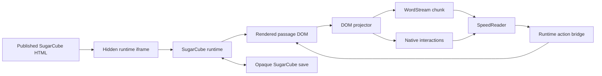

# Experiment 3 — SugarCube Runtime Ingestion With Native Interactivity

## Outcome

Add an optional SugarCube 2 ingestion engine that executes the runtime already bundled into a published Twine HTML story. SugarCube remains responsible for macros, TwineScript, variables, widgets, passage navigation, and story history. Speedreader observes the rendered passage DOM and translates it into `WordStream` chunks plus native reader interactions.

This avoids writing and maintaining a partial SugarCube interpreter. It also provides much broader compatibility with Story JavaScript and custom macros.

The component is intentionally unsafe: importing a story runs author-provided JavaScript. It must be clearly labeled as an optional trusted-content feature. The iframe is used to isolate DOM globals and CSS from React, not as a security boundary.

## Why the runtime approach works

A published Twine story is already a complete HTML application. It contains `<tw-storydata>` with the passages and the selected story format's compiled runtime. The [Twine 2 HTML output specification](https://github.com/iftechfoundation/twine-specs/blob/master/twine-2-htmloutput-spec.md) describes that structure.

SugarCube exposes the hooks needed by an adapter:

- passage lifecycle events including `:passagerender`, `:passagedisplay`, and `:passageend`;
- the rendered passage under `#passages .passage`;
- `Engine.play()`, history navigation, and current passage APIs;
- story state and save APIs;
- ordinary DOM controls for links, buttons, text fields, selections, and custom widgets.

These behaviors are documented in the [SugarCube 2 API reference](https://www.motoslave.net/sugarcube/2/docs/). SugarCube is BSD-2-Clause licensed, so a pinned runtime may also be redistributed with its license notice if raw Twee/archive import is added later. See the [SugarCube source repository](https://github.com/tmedwards/sugarcube-2).

## User experience

1. The user enables the optional `Run interactive SugarCube stories` feature.
2. They import a published `.html` or `.htm` SugarCube 2 story.
3. The library warns that the file's scripts will execute and stores the complete source HTML.
4. Opening the story starts a hidden SugarCube runtime host.
5. The current rendered passage is projected into paced words and native interactions.
6. When the reader answers, the bridge activates the corresponding control inside SugarCube.
7. SugarCube processes the macro, updates variables, and renders the next state or passage.
8. The bridge observes the new DOM and appends the resulting content.
9. Speedreader persists both its derived stream and an opaque SugarCube save string.

## Architecture



### Components

#### `SugarCubeRuntimeHost`

- Creates an offscreen same-origin iframe.
- Loads the original published story through a dedicated same-origin runtime
  document URL. The spike showed that `srcdoc` inherits the parent CSP and
  blocks the story's inline runtime, while a separate document does not.
- Waits for the iframe `load` event and verifies SugarCube globals are present.
- Exposes the child `document`, `Engine`, `State`, `Story`, and `Save` through a typed adapter.
- Attaches SugarCube lifecycle listeners and a `MutationObserver`.
- Destroys the iframe and listeners when the book closes.

Do not use `display: none`; some story code may depend on layout or visibility. Place the iframe offscreen with a stable viewport and prevent direct pointer interaction.

#### `SugarCubeDomProjector`

- Reads only the active passage container after SugarCube has rendered it.
- Walks text and block nodes in DOM order.
- Converts prose into normalized words and line-break formatting.
- Assigns deterministic IDs to interactive elements.
- Converts supported controls into existing `ReaderInteraction` descriptors.
- Sanitizes any inert HTML presentation that is copied into the main application.
- Produces a passage snapshot hash so duplicate lifecycle and mutation events do not append content twice.

The projector operates on SugarCube's rendered output, not passage source. All macro parsing, conditionals, variable interpolation, includes, widgets, and Story JavaScript have already run.

#### `SugarCubeActionBridge`

Maintains a map from deterministic action IDs to live child-DOM elements:

| Runtime element | Reader interaction | Response behavior |
|---|---|---|
| Passage links and buttons | `single-choice` | Call the selected element's `click()` |
| Text and textarea inputs | `text-input` | Set `value`, dispatch `input`/`change`, then continue |
| Radio groups and selects | `single-choice` | Select the value and dispatch `input`/`change` |
| Checkbox/toggle | `single-choice` with on/off options initially | Set `checked` and dispatch `change` |
| Submit/continue button | `continue` | Call `click()` |

Use normal DOM events rather than reimplementing macro semantics. SugarCube and story code remain the authority for what an action does.

#### `SugarCubeStateAdapter`

- On current SugarCube versions, call `Save.base64.save()` and persist the returned string.
- Restore with `Save.base64.load()`, then call `Engine.show()` and wait for the resulting render event.
- Feature-detect older stories and fall back to `Save.serialize()` / `Save.deserialize()` where available.
- Treat the save as an opaque versioned payload associated with the source story hash.
- Never inspect or partially merge SugarCube variables into Speedreader state.

SugarCube saves capture history moments, which are created by passage
navigation. The spike confirmed that DOM-only changes and variables changed by
same-passage controls may return to their passage-entry values after restore.
Exact mid-passage reopening therefore requires a separately validated generic
interaction journal; v1 must not imply that the opaque save alone preserves
those mutations.

The current API documents `Save.base64.save()` and `Save.base64.load()` for state serialization. Loading must occur after SugarCube startup, not during it.

## Persistence model

Persist three independent records:

| Record | Contents | Owner |
|---|---|---|
| Interactive source | Original executable HTML, source hash, detected format/version | Book |
| Derived stream | Words, visited-passage chapters, presentations, interactions | Playthrough cache |
| Reader state | Word position, interaction records, opaque SugarCube save, last projected snapshot | Playthrough |

This requires the same lifecycle correction identified in the original plan: SugarCube state belongs in `ReaderState.formatState`, not `Book.formatState`.

Add a `sources` IndexedDB store and bump the schema from version 1 to 2:

```ts
interface StoredInteractiveSource {
  bookId: string;
  format: "sugarcube-2-runtime";
  schemaVersion: 1;
  mimeType: "text/html";
  html: string;
  sourceHash: string;
  formatVersion?: string;
}

interface SugarCubeReaderState {
  schemaVersion: 1;
  sourceHash: string;
  saveApi: "base64" | "legacy-serialize";
  save: string;
  lastSnapshotId?: string;
  lastTurn?: number;
}
```

`ReaderApp.enqueueReaderState()` must not overwrite a newer runtime save with a position-only snapshot. Use one serialized full-state writer or add a merge-safe reader-state patch operation.

## Import and startup

### Import

1. Decode the file as HTML and verify `<tw-storydata format="SugarCube">`.
2. Read story name, IFID, start node, and `format-version` for metadata only.
3. Hash and persist the original HTML unchanged.
4. Create an empty, incomplete `WordStream`.
5. Mark the book format as `sugarcube-2-runtime`.
6. Display the executable-content warning before the first open.

The runtime already embedded in the story should be preferred over a globally pinned version. That maximizes compatibility with the version and plugins against which the author published the story.

### First open

1. Mount the iframe with the stored HTML.
2. Wait for SugarCube startup to finish.
3. Attach lifecycle and mutation observation.
4. Snapshot the current active passage.
5. Project the passage into the initial `StreamChunk`.
6. Persist an opaque SugarCube save.

### Reopen

1. Mount a fresh runtime from the same source HTML.
2. Wait for startup.
3. Load the persisted SugarCube save.
4. Wait for SugarCube to render the restored moment.
5. Reconcile its snapshot ID with the cached stream.
6. Restore the saved Speedreader word position and pending native interaction.

If the source hash or runtime format version no longer matches the save, require a story restart rather than attempting a partial migration.

## Projection rules

### Passage navigation

Each newly displayed SugarCube passage becomes one appended reader chapter. Use SugarCube's turn number plus passage name as the chapter identity so revisits remain distinct.

Group ordinary passage links/buttons visible in one stable snapshot into a single native choice at the boundary where the controls occur. Selecting an option clicks only that corresponding runtime element.

### Same-passage mutations

SugarCube interactions such as `<<linkreplace>>`, `<<linkappend>>`, cycles, checkboxes, and custom widgets may change the current DOM without navigating. The `MutationObserver` schedules a debounced resnapshot after the event loop settles.

For v1:

- append newly revealed text and new controls;
- ignore style/class-only mutations;
- replace the pending interaction set when controls disappear or change;
- fail with a compatibility message if previously emitted prose is destructively rewritten in a way that cannot be represented by the append-only stream.

A later stream-splice operation can support destructive same-passage rewrites. This—not macro interpretation—is the main compatibility boundary of the runtime approach.

### Passive content

- Text-bearing block elements contribute words.
- Headings, paragraphs, lists, and breaks contribute word formatting and passage structure.
- Tables or author UI may become sanitized `HtmlPresentation` nodes when plain-text projection loses essential structure.
- Images, audio, canvas, and author styling remain in the hidden runtime but are not reproduced in the speed-reading view for v1.

## Optional and unsafe by design

The feature should state plainly:

> SugarCube stories are executable applications. Only import files you trust. Story scripts run with the permissions available to this application view.

Minimal engineering guardrails are still worthwhile because they prevent accidents without claiming to sandbox the story:

- keep the runtime in its own iframe so IDs, globals, and CSS do not collide with React;
- do not expose additional Tauri commands or application secrets to the iframe;
- remove the iframe completely when the story closes;
- cap imported file size and projected word count to prevent accidental hangs or storage exhaustion;
- catch runtime errors and offer restart/back-to-library actions.

No custom interpreter, macro allowlist, CSP rewriting, or hostile-input compatibility promise is required.

## Repository changes

### New modules

```text
frontend/src/ingestion/sugarcube/
  types.ts                 source, snapshot, action, and save types
  detect.ts                SugarCube HTML detection and metadata
  runtime-host.ts          iframe lifecycle and SugarCube API adapter
  dom-projector.ts         rendered DOM -> words and interactions
  action-bridge.ts         reader responses -> child DOM events
  state-adapter.ts         SugarCube save/restore feature detection
  format.ts                InteractiveFormat orchestration
  snapshot.ts              deterministic DOM snapshot IDs and reconciliation
  index.ts                 public exports
  fixtures/                published SugarCube HTML stories
```

### Existing modules

| File/area | Change |
|---|---|
| `ingestion/types.ts` | Add stored interactive-source/import result types |
| `ingestion/engine.ts` | Detect and register `sugarcube-2-runtime` imports |
| `db/types.ts` | Add source CRUD and merge-safe reader-state updates |
| `db/indexeddb.ts` | Add `sources` store and cascade deletion |
| `library/store.ts` | Persist source, start runtime sessions, append snapshots, save runtime state, restart |
| `ReaderApp.tsx` | Register adapter, accept `.html,.htm`, coordinate complete runtime state |
| `LibraryView.tsx` | Add executable-content warning and format label |
| `ReaderScreen.tsx` | Add runtime-loading/error state and `Restart story` |
| `interactions/types.ts` | Prefer existing kinds; add a runtime-control kind only if real fixtures require it |

No SugarCube-specific type should leak into pacing, display timing, or navigation.

## Implementation sequence

### Milestone 0 — Runtime spike

- Add one tiny published SugarCube fixture with variables, a choice, Story JavaScript, and a custom macro.
- Load it into an offscreen iframe.
- Read the first rendered passage.
- Click a link programmatically and observe the next passage.
- Save, recreate the iframe, restore, and confirm the same passage/variables.

Exit criterion: the bundled runtime can be driven headlessly in the Vite browser build and Tauri webview. Do this before database or UI work.

### Milestone 1 — Source persistence

- Add SugarCube detection and metadata extraction.
- Add IndexedDB schema v2 and executable HTML storage.
- Wire import, open, delete, and source-hash validation.

Exit criterion: a story can be imported, closed, reopened, and deleted without losing its runtime source.

### Milestone 2 — DOM projection

- Implement block/text traversal, normalization, snapshot IDs, and visited-passage chapters.
- Project links, buttons, inputs, radio groups, selects, and checkboxes.
- Deduplicate overlapping lifecycle/mutation notifications.

Exit criterion: projection of the same rendered DOM is deterministic and produces correct word/action boundaries.

### Milestone 3 — Interactive bridge

- Map native responses back to runtime elements.
- Dispatch real DOM events and wait for stable output.
- Append navigation output and newly revealed same-passage content.
- Handle stale/disappeared controls as recoverable runtime errors.

Exit criterion: a branching story can be completed entirely through Speedreader's native controls while SugarCube owns all logic.

### Milestone 4 — State and app integration

- Persist opaque SugarCube saves with the reader state.
- Restore pending interactions and avoid duplicate chunks on reopen.
- Add restart, loading, crash, and incompatible-save UI.
- Verify RSVP and traditional modes.

Exit criterion: reload before/after actions and mid-passage restores the same runtime state and derived reading position.

### Milestone 5 — Compatibility hardening

- Test widgets, StoryInit, passage lifecycle code, link replacement/appending, form macros, and history navigation.
- Add stream-splice support only if destructive DOM rewrites are common enough to justify it.
- Add legacy save API support based on actual format versions in fixtures.

Exit criterion: the supported runtime/DOM behaviors are documented from conformance tests rather than inferred from macro syntax.

## Test plan

- Detection: valid SugarCube, wrong story format, malformed HTML, missing story data.
- Runtime lifecycle: startup, close, crash, restart, and repeated open/close without leaked frames/listeners.
- Projection: block ordering, whitespace, hidden nodes, nested controls, deterministic action IDs.
- Navigation: passage links, buttons, setter links, conditionals, includes, and custom macros.
- Same-passage behavior: append, replace, cycle, input/change, and disappearing controls.
- Persistence: base64 save/load, legacy feature detection, source mismatch, concurrent position/runtime saves.
- Idempotency: duplicate render events and mutation bursts never append duplicate words.
- Cross-platform smoke tests: browser/PWA and Tauri.

## Definition of done for v1

- A trusted published SugarCube 2 HTML story can be imported and run using its bundled runtime.
- Story JavaScript, macros, widgets, conditions, variables, and passage history remain owned by SugarCube.
- Rendered prose becomes paced words without source-level macro parsing.
- Common links and form controls become native reader interactions that drive the live runtime DOM.
- Derived stream, reader position, and opaque SugarCube save survive reload without duplicated output.
- Restart and deletion have clear persistence semantics.
- The UI clearly labels the feature as optional executable content.
- `npm run check` passes with runtime-host, projection, bridge, persistence, and integration tests.

## Later decisions

1. Add raw Twee 3 or Twine archive import by compiling it against a vendored, pinned SugarCube runtime.
2. Add multiple SugarCube playthrough/save slots per book.
3. Add stream splicing for destructive same-passage DOM changes and SugarCube history rewrites.
4. Decide whether complex author-rendered controls should sometimes be shown directly instead of translated into native reader interactions.
