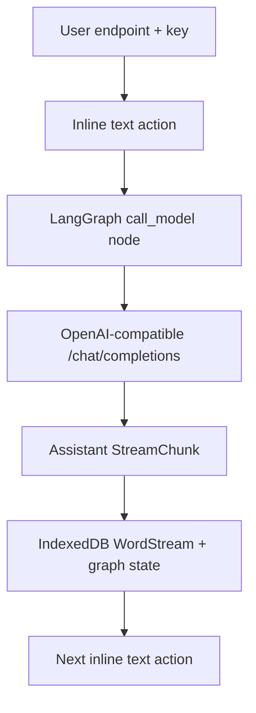

# OpenAI-compatible LangGraph ingestion plan

## Goal

Treat a conversation as an open-ended `InteractiveFormat`: the reader presents a native text action, LangGraph sends the response to a user-supplied OpenAI-compatible endpoint, and the assistant response becomes the next persistent segment of the same `WordStream`.

The endpoint, model, and key are runtime dependencies. They are not book content and must never be written to `Book`, `ReaderState`, `WordStream`, checkpoints, logs, or test snapshots. By default the first implementation keeps them in memory. The user may explicitly store an AES-GCM-encrypted key in a separate IndexedDB credential vault; its passphrase and derived key are never persisted.

## Current PR boundary



This PR includes:

- A built-in `LLM Chat` book and normal library seeding/reset lifecycle.
- A connection dialog requiring an endpoint and API key; model is explicit or discovered from `/models`.
- Optional passphrase-based persistence using PBKDF2-HMAC-SHA-256 (600,000 iterations), fresh per-record salt/IV, AES-256-GCM, authenticated endpoint/model metadata, and a separate IndexedDB database.
- CSP permits user-selected HTTPS connections and loopback HTTP only; compatible web endpoints must allow the app origin through CORS.
- A LangGraph `StateGraph` with a replaceable checkpoint saver.
- JSON-safe session, message, turn, and handled-interaction state.
- One complete request at a time using non-streaming Chat Completions.
- Plain word projection that preserves Markdown syntax literally.
- Stable `llmTurnId` metadata so later replay can identify generated suffixes.

The encrypted web vault protects an API key against offline extraction of IndexedDB. It does not protect an unlocked key from malicious same-origin JavaScript; native builds should still move credentials and requests behind a Tauri-owned transport.

## Follow-up 1: durable checkpointer and sessions

Add an IndexedDB-backed LangGraph `BaseCheckpointSaver`, keyed by the existing `sessionId` passed as `configurable.thread_id`. Checkpoints own graph execution state; `Book.formatState` retains only the active session reference and lightweight projection cursor.

Each chat becomes its own library child rather than sharing one mutable built-in stream:

```ts
interface ChatSummary {
  sessionId: string;
  title: string;
  createdAt: number;
  updatedAt: number;
  parentBookId: string;
}
```

The library can show recent chats in a drawer on the LLM tile or reader. Creating a chat creates a new session and stream; selecting one rehydrates its checkpoint and cached WordStream. Connection credentials remain outside these records.

## Follow-up 2: persistent generation outside focus

Browser timers and network requests are not reliable after a tab is suspended. Model execution should move behind a `GenerationRuntime` interface:

```ts
interface GenerationRuntime {
  start(request: GenerationRequest): Promise<{ runId: string }>;
  subscribe(runId: string, onEvent: (event: GenerationEvent) => void): () => void;
  reconnect(runId: string, cursor?: string): Promise<void>;
}
```

- Tauri: run HTTP and LangGraph orchestration in a native command/background task and emit events to the webview.
- Web/PWA: use a server-owned run with reconnectable SSE/WebSocket events. A service worker alone cannot guarantee long-running generation.
- Persist `runId`, event cursor, and pending user turn before starting the request. Reconnection must be idempotent.

## Follow-up 3: Markdown event stream to WordStream

Switch Chat Completions to `stream: true`. Decode SSE into model deltas, then feed an incremental Markdown parser that emits semantic projection events rather than repeatedly reparsing the complete answer:

```ts
type MarkdownProjectionEvent =
  | { kind: "text"; text: string }
  | { kind: "break"; count: number }
  | { kind: "format-open"; format: "emphasis" | "strong" | "code" }
  | { kind: "format-close"; format: "emphasis" | "strong" | "code" };
```

Only complete lexical tokens are committed as words; a small trailing buffer holds partial Markdown delimiters and partial words. Every append is tagged with `llmTurnId`, and finalization flushes the buffer. Active HTML is never accepted from model output.

## Follow-up 4: tools through LangGraph

Extend graph state with structured assistant tool calls and tool results. Add a conditional edge from `call_model` to a `ToolNode`, then back to the model. Tools are registered explicitly with capability metadata; unregistered calls fail closed.

Tool execution needs:

- Per-tool input validation and bounded output.
- User approval policy for side effects.
- Durable tool-call IDs so checkpoint replay does not repeat mutations.
- A presentation node for tool progress that is separate from generated prose.
- Cancellation and timeout propagation through the generation runtime.

## Follow-up 5: redo and branching

Redo is graph time travel, not an in-place string replacement. Save the LangGraph checkpoint ID and output word range for every turn:

```ts
interface ChatTurnProjection {
  turnId: string;
  userInteractionId: string;
  checkpointId: string;
  startIndex: number;
  endIndex: number;
  status: "pending" | "complete" | "failed";
}
```

Redo selects the checkpoint before the assistant node, truncates the projected WordStream suffix in one database transaction, invalidates later interaction records, and runs a new branch. Preserve the old branch until the replacement succeeds so failure cannot destroy readable history. Editing a prior user action follows the same operation with a modified user message.

## Acceptance sequence

1. Current PR: user-owned connection, LangGraph request loop, persistent projected conversation.
2. Checkpointer PR: session rehydration and chat drawer.
3. Runtime PR: reconnectable generation while unfocused.
4. Streaming PR: incremental Markdown-to-word projection.
5. Tools PR: validated conditional tool loop.
6. Replay PR: checkpoint-backed redo, edit, and branch selection.
